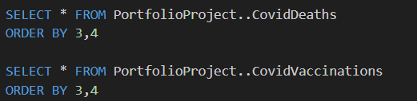
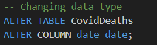
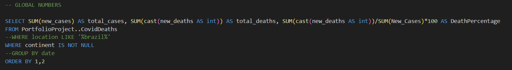
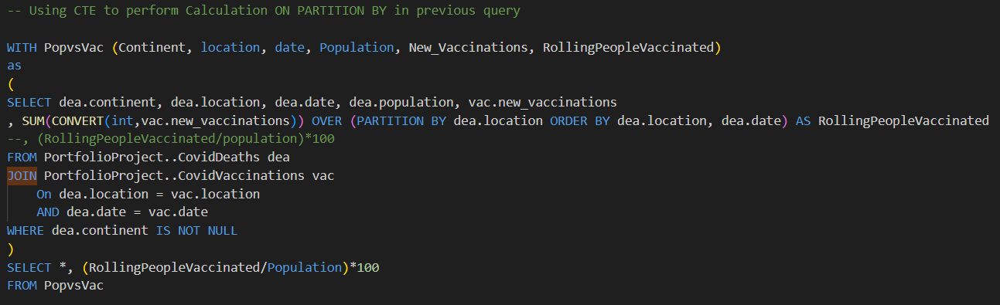
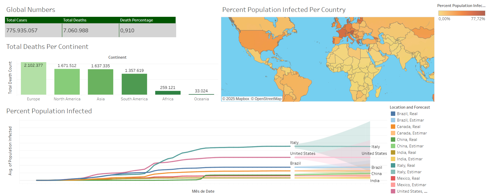
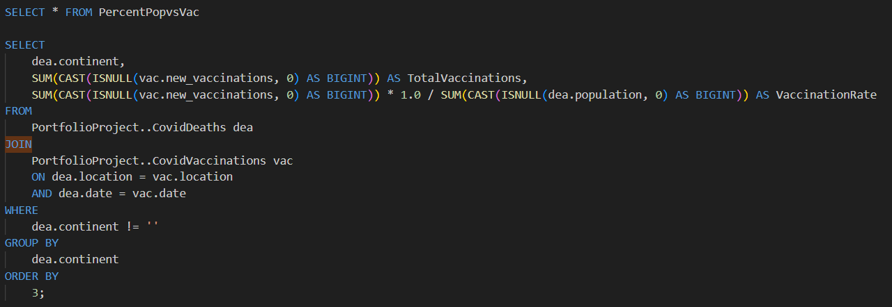
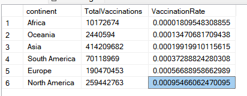

# COVID-19 Data Analysis and Visualization

## Introduction
The main goal of this project was to go through the process of data exploration using COVID datasets, import the data into SQL Server, and then export it to Tableau to bring meaningful insights to the analysis. This project involved the application of various data analysis skills, including:

- Joins
- Common Table Expressions (CTEs)
- Temporary Tables
- Window Functions
- Aggregate Functions
- Creating Views
- Converting Data Types

The data was downloaded from [Our World in Data](https://ourworldindata.org/covid-deaths) and separated into two tables so I could use Joins in SQL queries. The `.csv` files were imported into SQL Server, and the analysis began with simple `SELECT` statements to understand the dataset.

During the initial exploration, I noticed that the date formats were inconsistent. To resolve this, I converted the date fields into the correct format, making the data more usable for analysis.

With the data cleaned, I performed more complex analyses, such as calculating global statistics, analyzing deaths per continent, determining the percentage of the population infected by the virus, and calculating vaccination rates across countries. These queries utilized SQL features such as CTEs, views, and joins. The SQL file containing all queries is available in the repository.

## Dashboard Development

For data visualization, I used Tableau to present the insights gained during the analysis. This project provided an excellent opportunity to enhance my Tableau skills. Some of the insights include death rates across continents, vaccination rates by country, and relationships between vaccination rates and death rates.

The complete visualization can be accessed here: [Covid Dashboard](https://public.tableau.com/app/profile/arthur.picolo.dos.reis/viz/CovidDashboard_17371238803370/Dashboard).

## Conclusion
Europe and North America had the highest death rates compared to other continents. Surprisingly, there was no clear correlation between vaccination rates and death rates per continent. Additionally, the global death percentage was less than 1%, indicating that 99% of those infected survived. 

